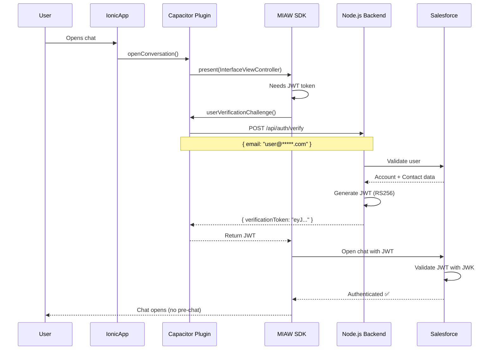

# 🔐 User Verification for MIAW - Implementation Guide

**Project**: MIAW Capacitor App (Ionic + iOS/Android)
**Date**: December 2024
**Status**: 📋 Pending Implementation

---

## 📋 Table of Contents

1. [Overview](#overview)
2. [Architecture](#architecture)
3. [Prerequisites](#prerequisites)
4. [Backend Setup](#backend-setup)
5. [iOS Implementation](#ios-implementation)
6. [Android Implementation](#android-implementation)
7. [Testing](#testing)
8. [Security Considerations](#security-considerations)
9. [Troubleshooting](#troubleshooting)

---

## 🎯 Overview

### What is User Verification?

User Verification allows authenticated users to:
- ✅ Skip pre-chat forms
- ✅ Access their full conversation history
- ✅ Be automatically identified with their Account and Contact
- ✅ Receive personalized support from the first message

### Differences: Web vs. Mobile

| Feature | **Web (Embedded Messaging)** | **MIAW (In-App Messaging)** |
|---------|------------------------------|------------------------------|
| SDK | `embeddedservice_bootstrap.js` | `SMIClientCore` + `SMIClientUI` |
| JWT Method | `setIdentityToken(token)` | `UserVerificationDelegate` |
| Timing | Before chat initialization | SDK calls delegate when needed |
| Architecture | Frontend calls backend | Native plugin calls backend |

---

## 🏗️ Architecture



---

## ✅ Prerequisites

### 1. Salesforce Configuration

Ensure these are already configured (from web implementation):

- [x] RSA keys generated (`private-key.pem`, `public-key.pem`)
- [x] JWK uploaded to Salesforce (without `use` and `alg` fields)
- [x] Keyset created: `GRG Messaging Keyset`
  - Issuer: `grg-messaging-server`
  - Type: Keys (not Endpoint)
- [x] Embedded Service Deployment:
  - User Verification: ✅ Enabled
  - Keyset: `GRG Messaging Keyset`
  - Developer Name: `SC_AComerClubMobile` (or your deployment)

### 2. SDK Version

- **Minimum required**: MIAW SDK v1.2.0
- **Current version**: ✅ v1.10.2 (already installed)

### 3. Backend Available

- Node.js backend with JWT generation
- RSA-256 signing
- Accessible from mobile app (public URL or VPN)

---

## 🖥️ Backend Setup

### Option 1: Reuse Existing Backend

You already have a working backend at:
```
~/dev/grg-ss-agentforce/examples/salesforce-messaging-auth/
```

**Files**:
- `server-with-rsa.js` - Main server
- `private-key.pem` - RSA private key (⚠️ NEVER commit)
- `public-key.pem` - RSA public key
- `public-key.jwk.json` - JWK for Salesforce

### Option 2: Create New Mobile Endpoint

If you need a mobile-specific endpoint, add this to your backend:

```javascript
// server-with-rsa.js or new mobile-auth.js

const express = require('express');
const jwt = require('jsonwebtoken');
const fs = require('fs');
const axios = require('axios');

const app = express();
app.use(express.json());

// Load RSA private key
const privateKey = fs.readFileSync('./private-key.pem', 'utf8');

// Mobile-specific verification endpoint
app.post('/api/mobile/auth/verify', async (req, res) => {
    try {
        const { email, userId } = req.body;

        // Validate user (check against your user database or Salesforce)
        const userData = await validateUser(email, userId);

        if (!userData) {
            return res.status(401).json({ error: 'User not found' });
        }

        // Generate JWT
        const token = jwt.sign(
            {
                sub: userData.contactId,         // e.g., "003XXXXXXXXXXXXXXXXX"
                email: userData.email,            // e.g., "user@example.com"
                firstName: userData.firstName,    // e.g., "John"
                lastName: userData.lastName,      // e.g., "Doe"
                accountId: userData.accountId,    // e.g., "001XXXXXXXXXXXXXXXXX"
                iss: 'grg-messaging-server',      // Must match Salesforce Keyset
                aud: 'salesforce',
                exp: Math.floor(Date.now() / 1000) + (24 * 60 * 60) // 24 hours
            },
            privateKey,
            {
                algorithm: 'RS256',
                keyid: 'grg-key-1'                // Must match JWK kid
            }
        );

        res.json({
            verificationToken: token,
            sessionToken: token, // Optional: for session management
            user: {
                contactId: userData.contactId,
                email: userData.email,
                firstName: userData.firstName,
                lastName: userData.lastName
            }
        });

    } catch (error) {
        console.error('Error generating token:', error);
        res.status(500).json({ error: 'Internal server error' });
    }
});

async function validateUser(email, userId) {
    // Option 1: Query your local database
    // const user = await db.users.findOne({ email });

    // Option 2: Query Salesforce
    // const sfResponse = await querySalesforce(email);

    // For now, mock data:
    return {
        contactId: '003XXXXXXXXXXXXXXXXX',  // Replace with real Salesforce Contact ID
        email: email,
        firstName: 'User',
        lastName: 'Name',
        accountId: '001XXXXXXXXXXXXXXXXX'   // Replace with real Salesforce Account ID
    };
}

app.listen(3000, () => {
    console.log('Mobile auth server running on port 3000');
});
```

### Environment Variables

Create `.env` file:

```bash
# Backend Configuration
PORT=3000
NODE_ENV=production

# Salesforce OAuth (if validating against Salesforce)
SF_LOGIN_URL=https://your-instance.my.salesforce.com
SF_CLIENT_ID=YOUR_CONSUMER_KEY
SF_CLIENT_SECRET=YOUR_CONSUMER_SECRET
SF_USERNAME=your-sf-username@example.com
SF_PASSWORD=your-password-with-security-token

# JWT Configuration
JWT_ISSUER=grg-messaging-server
JWT_AUDIENCE=salesforce
JWT_KEY_ID=grg-key-1
JWT_EXPIRATION_HOURS=24

# Paths
PRIVATE_KEY_PATH=./private-key.pem
PUBLIC_KEY_PATH=./public-key.pem
```

### Deploy Backend

Ensure your backend is accessible from mobile devices:

**Options**:
1. **Development**: Use ngrok or similar
   ```bash
   ngrok http 3000
   # Use: https://xxxx-xx-xx-xxx-xxx.ngrok.io/api/mobile/auth/verify
   ```

2. **Production**: Deploy to cloud
   - Heroku
   - AWS Lambda + API Gateway
   - Google Cloud Functions
   - Azure Functions

---

## 📱 iOS Implementation

### Step 1: Update `SFMiawManager.swift`

File: `/Users/jterrats/dev/capacitor-salesforce-miaw/ios/Sources/SFMiawPlugin/SFMiawManager.swift`

```swift
import Foundation
import UIKit
import SMIClientCore
import SMIClientUI

@available(iOS 14.1, *)
@objc public class SFMiawManager: NSObject {

    // MARK: - Properties
    private var initialized = false
    private var uiConfiguration: UIConfiguration?
    private var coreClient: CoreClient?
    private var conversationId: UUID?

    // NEW: Store authenticated user info
    private var authenticatedUserEmail: String?
    private var backendUrl: String?

    // MARK: - Singleton
    @objc public static let shared = SFMiawManager()

    // MARK: - Configuration
    @objc public func setBackendUrl(_ url: String) {
        self.backendUrl = url
        print("[SFMiawManager] Backend URL set: \(url)")
    }

    @objc public func setAuthenticatedUser(email: String) {
        self.authenticatedUserEmail = email
        print("[SFMiawManager] Authenticated user email set: \(email)")
    }

    // MARK: - Initialize with User Verification
    @objc public func initialize(serviceUrl: String?,
                                organizationId: String?,
                                developerName: String?,
                                userVerificationRequired: Bool = true) {  // NEW parameter

        var url = serviceUrl
        var orgId = organizationId
        var devName = developerName

        if url == nil || orgId == nil || devName == nil {
            if let config = loadConfigFromBundle() {
                url = config["Url"] as? String
                orgId = config["OrganizationId"] as? String
                devName = config["DeveloperName"] as? String
            }
        }

        guard let serviceApiUrlString = url,
              let orgId = orgId,
              let devName = devName,
              let serviceApiUrl = URL(string: serviceApiUrlString) else {
            print("[SFMiawManager] ❌ Error: Missing configuration parameters")
            return
        }

        let convId = conversationId ?? UUID()
        conversationId = convId

        // ⬇️ NEW: Create configuration with user verification
        let coreConfig = Configuration(
            serviceAPI: serviceApiUrl,
            organizationId: orgId,
            developerName: devName,
            userVerificationRequired: userVerificationRequired  // ⬅️ Enable User Verification
        )

        let uiConfig = UIConfiguration(
            configuration: coreConfig,
            conversationId: convId
        )

        uiConfig.conversationOptionsConfiguration = ConversationOptionsConfiguration(
            allowEndChat: true
        )

        self.uiConfiguration = uiConfig

        let client = CoreFactory.create(withConfig: uiConfig)

        // ⬇️ NEW: Set User Verification Delegate
        if userVerificationRequired {
            client.userVerificationDelegate = self
            print("[SFMiawManager] ✅ User Verification Delegate set")
        }

        self.coreClient = client
        client.start()

        initialized = true
        print("[SFMiawManager] ✅ SDK initialized with User Verification: \(userVerificationRequired)")
    }

    // ... rest of existing methods (open, close, cleanup) ...
}

// MARK: - User Verification Delegate
@available(iOS 14.1, *)
extension SFMiawManager: UserVerificationDelegate {

    public func userVerificationChallenge(withReason reason: UserVerificationChallengeReason) async throws -> String {
        print("[SFMiawManager] 🔐 SDK requesting JWT token")
        print("[SFMiawManager] Reason: \(reason)")

        guard let email = authenticatedUserEmail else {
            print("[SFMiawManager] ❌ No authenticated user email set")
            throw NSError(domain: "SFMiawManager", code: 401, userInfo: [
                NSLocalizedDescriptionKey: "No authenticated user"
            ])
        }

        guard let backendUrl = backendUrl else {
            print("[SFMiawManager] ❌ No backend URL configured")
            throw NSError(domain: "SFMiawManager", code: 500, userInfo: [
                NSLocalizedDescriptionKey: "Backend URL not configured"
            ])
        }

        do {
            let token = try await fetchJWTFromBackend(email: email, backendUrl: backendUrl)
            print("[SFMiawManager] ✅ JWT token received (length: \(token.count))")
            print("[SFMiawManager] Token (first 50 chars): \(String(token.prefix(50)))...")
            return token
        } catch {
            print("[SFMiawManager] ❌ Error fetching JWT: \(error)")
            throw error
        }
    }

    private func fetchJWTFromBackend(email: String, backendUrl: String) async throws -> String {
        let url = URL(string: "\(backendUrl)/api/mobile/auth/verify")!
        var request = URLRequest(url: url)
        request.httpMethod = "POST"
        request.setValue("application/json", forHTTPHeaderField: "Content-Type")
        request.timeoutInterval = 30

        let body: [String: Any] = [
            "email": email,
            "userId": authenticatedUserEmail ?? ""
        ]

        request.httpBody = try JSONSerialization.data(withJSONObject: body)

        print("[SFMiawManager] 📤 Requesting JWT from: \(url.absoluteString)")

        let (data, response) = try await URLSession.shared.data(for: request)

        guard let httpResponse = response as? HTTPURLResponse else {
            throw NSError(domain: "SFMiawManager", code: 500, userInfo: [
                NSLocalizedDescriptionKey: "Invalid response"
            ])
        }

        print("[SFMiawManager] 📥 Backend response status: \(httpResponse.statusCode)")

        guard httpResponse.statusCode == 200 else {
            let errorMessage = String(data: data, encoding: .utf8) ?? "Unknown error"
            throw NSError(domain: "SFMiawManager", code: httpResponse.statusCode, userInfo: [
                NSLocalizedDescriptionKey: "Backend error: \(errorMessage)"
            ])
        }

        let json = try JSONSerialization.jsonObject(with: data) as? [String: Any]

        guard let token = json?["verificationToken"] as? String else {
            throw NSError(domain: "SFMiawManager", code: 500, userInfo: [
                NSLocalizedDescriptionKey: "Token not found in response"
            ])
        }

        return token
    }
}

// MARK: - Logout
@available(iOS 14.1, *)
extension SFMiawManager {

    @objc public func logout(completion: @escaping (Bool, Error?) -> Void) {
        print("[SFMiawManager] 🚪 Logging out and revoking token")

        coreClient?.revokeTokenAndDeregisterDevice { result in
            switch result {
            case .success:
                print("[SFMiawManager] ✅ Token revoked successfully")
                self.authenticatedUserEmail = nil
                completion(true, nil)
            case .failure(let error):
                print("[SFMiawManager] ❌ Error revoking token: \(error)")
                completion(false, error)
            }
        }
    }
}
```

### Step 2: Update `SFMiawPlugin.swift`

File: `/Users/jterrats/dev/capacitor-salesforce-miaw/ios/Sources/SFMiawPlugin/SFMiawPlugin.swift`

```swift
import Capacitor

@available(iOS 14.1, *)
@objc(SFMiawPlugin)
public class SFMiawPlugin: CAPPlugin, CAPBridgedPlugin {

    public let identifier = "SFMiawPlugin"
    public let jsName = "Miaw"
    public let pluginMethods: [CAPPluginMethod] = [
        CAPPluginMethod(name: "initialize", returnType: CAPPluginReturnPromise),
        CAPPluginMethod(name: "setBackendUrl", returnType: CAPPluginReturnPromise),
        CAPPluginMethod(name: "setAuthenticatedUser", returnType: CAPPluginReturnPromise),
        CAPPluginMethod(name: "openConversation", returnType: CAPPluginReturnPromise),
        CAPPluginMethod(name: "closeConversation", returnType: CAPPluginReturnPromise),
        CAPPluginMethod(name: "logout", returnType: CAPPluginReturnPromise)
    ]

    private let manager = SFMiawManager.shared

    // NEW: Set Backend URL
    @objc func setBackendUrl(_ call: CAPPluginCall) {
        guard let url = call.getString("backendUrl") else {
            call.reject("Missing backendUrl parameter")
            return
        }

        manager.setBackendUrl(url)
        call.resolve(["status": "ok"])
    }

    // NEW: Set Authenticated User
    @objc func setAuthenticatedUser(_ call: CAPPluginCall) {
        guard let email = call.getString("email") else {
            call.reject("Missing email parameter")
            return
        }

        manager.setAuthenticatedUser(email: email)
        call.resolve(["status": "ok"])
    }

    @objc func initialize(_ call: CAPPluginCall) {
        let configFileName = call.getString("configFileName")
        let userVerificationRequired = call.getBool("userVerificationRequired", true)  // NEW

        if let fileName = configFileName {
            // Initialize from config file
            manager.initializeFromBundle()
        } else {
            let url = call.getString("Url")
            let orgId = call.getString("OrganizationId")
            let devName = call.getString("DeveloperName")

            manager.initialize(
                serviceUrl: url,
                organizationId: orgId,
                developerName: devName,
                userVerificationRequired: userVerificationRequired
            )
        }

        call.resolve(["status": "ok"])
    }

    // NEW: Logout
    @objc func logout(_ call: CAPPluginCall) {
        manager.logout { success, error in
            if success {
                call.resolve(["status": "ok"])
            } else {
                call.reject("Error during logout: \(error?.localizedDescription ?? "Unknown")")
            }
        }
    }

    // ... existing openConversation and closeConversation methods ...
}
```

### Step 3: Update `configFile.json` (iOS)

File: `/Users/jterrats/dev/miawapp/ios/App/App/configFile.json`

```json
{
  "Url": "https://your-salesforce-instance.my.salesforce.com",
  "OrganizationId": "00D************************",
  "DeveloperName": "SC_AComerClubMobile",
  "UserVerificationRequired": true
}
```

---

## 🤖 Android Implementation

### Step 1: Update `SFMiawManager.java`

File: `/Users/jterrats/dev/capacitor-salesforce-miaw/android/src/main/java/com/professionalserviceslatam/plugins/miaw/SFMiawManager.java`

```java
package com.professionalserviceslatam.plugins.miaw;

import android.app.Application;
import android.content.Context;
import android.util.Log;

import com.salesforce.android.smi.core.CoreClient;
import com.salesforce.android.smi.core.CoreConfiguration;
import com.salesforce.android.smi.core.CoreFactory;
import com.salesforce.android.smi.core.UserVerificationChallengeReason;
import com.salesforce.android.smi.core.UserVerificationDelegate;

import org.json.JSONObject;

import java.io.BufferedReader;
import java.io.InputStreamReader;
import java.io.OutputStream;
import java.net.HttpURLConnection;
import java.net.URL;
import java.util.UUID;

import kotlin.coroutines.Continuation;

public class SFMiawManager implements UserVerificationDelegate {

    private static final String TAG = "MIAW";
    private static SFMiawManager instance;

    private Application application;
    private CoreClient coreClient;
    private UUID conversationId;
    private boolean initialized = false;

    // NEW: User Verification properties
    private String authenticatedUserEmail;
    private String backendUrl;

    public static synchronized SFMiawManager getInstance() {
        if (instance == null) {
            instance = new SFMiawManager();
        }
        return instance;
    }

    private SFMiawManager() {
    }

    // NEW: Configuration methods
    public void setBackendUrl(String url) {
        this.backendUrl = url;
        Log.d(TAG, "Backend URL set: " + url);
    }

    public void setAuthenticatedUser(String email) {
        this.authenticatedUserEmail = email;
        Log.d(TAG, "Authenticated user email set: " + email);
    }

    // Initialize with User Verification
    public void initialize(
            Application app,
            String serviceUrl,
            String orgId,
            String developerName,
            boolean userVerificationRequired  // NEW parameter
    ) {
        Log.d(TAG, "=== INITIALIZE WITH USER VERIFICATION ===");
        Log.d(TAG, "User Verification Required: " + userVerificationRequired);

        this.application = app;
        this.conversationId = UUID.randomUUID();

        try {
            CoreConfiguration config = CoreConfiguration.builder()
                .serviceApiUrl(serviceUrl)
                .organizationId(orgId)
                .developerName(developerName)
                .userVerificationRequired(userVerificationRequired)  // ⬅️ NEW
                .build();

            CoreFactory factory = CoreClient.Companion.getFactory();
            this.coreClient = factory.create(config);

            // ⬇️ NEW: Set User Verification Delegate
            if (userVerificationRequired) {
                coreClient.setUserVerificationDelegate(this);
                Log.d(TAG, "✅ User Verification Delegate set");
            }

            initialized = true;
            Log.d(TAG, "✅ SDK initialized");

        } catch (Exception e) {
            Log.e(TAG, "❌ Error initializing SDK", e);
        }
    }

    // ⬇️ NEW: User Verification Delegate Implementation
    @Override
    public Object userVerificationChallenge(
            UserVerificationChallengeReason reason,
            Continuation<? super String> continuation
    ) {
        Log.d(TAG, "🔐 SDK requesting JWT token");
        Log.d(TAG, "Reason: " + reason);

        if (authenticatedUserEmail == null) {
            Log.e(TAG, "❌ No authenticated user email set");
            return "ERROR: No authenticated user";
        }

        if (backendUrl == null) {
            Log.e(TAG, "❌ No backend URL configured");
            return "ERROR: Backend URL not configured";
        }

        try {
            String token = fetchJWTFromBackend(authenticatedUserEmail, backendUrl);
            Log.d(TAG, "✅ JWT token received (length: " + token.length() + ")");
            Log.d(TAG, "Token (first 50 chars): " + token.substring(0, Math.min(50, token.length())) + "...");
            return token;
        } catch (Exception e) {
            Log.e(TAG, "❌ Error fetching JWT", e);
            return "ERROR: " + e.getMessage();
        }
    }

    private String fetchJWTFromBackend(String email, String backendUrl) throws Exception {
        URL url = new URL(backendUrl + "/api/mobile/auth/verify");
        HttpURLConnection conn = (HttpURLConnection) url.openConnection();

        try {
            conn.setRequestMethod("POST");
            conn.setRequestProperty("Content-Type", "application/json");
            conn.setDoOutput(true);
            conn.setConnectTimeout(30000);
            conn.setReadTimeout(30000);

            // Request body
            JSONObject requestBody = new JSONObject();
            requestBody.put("email", email);
            requestBody.put("userId", email);

            Log.d(TAG, "📤 Requesting JWT from: " + url.toString());

            // Send request
            OutputStream os = conn.getOutputStream();
            os.write(requestBody.toString().getBytes("UTF-8"));
            os.close();

            int responseCode = conn.getResponseCode();
            Log.d(TAG, "📥 Backend response status: " + responseCode);

            if (responseCode != 200) {
                BufferedReader errorReader = new BufferedReader(
                    new InputStreamReader(conn.getErrorStream())
                );
                StringBuilder errorResponse = new StringBuilder();
                String line;
                while ((line = errorReader.readLine()) != null) {
                    errorResponse.append(line);
                }
                errorReader.close();
                throw new Exception("Backend error: " + errorResponse.toString());
            }

            // Read response
            BufferedReader reader = new BufferedReader(
                new InputStreamReader(conn.getInputStream())
            );
            StringBuilder response = new StringBuilder();
            String line;
            while ((line = reader.readLine()) != null) {
                response.append(line);
            }
            reader.close();

            JSONObject jsonResponse = new JSONObject(response.toString());
            String token = jsonResponse.getString("verificationToken");

            if (token == null || token.isEmpty()) {
                throw new Exception("Token not found in response");
            }

            return token;

        } finally {
            conn.disconnect();
        }
    }

    // NEW: Logout method
    public void logout(LogoutCallback callback) {
        Log.d(TAG, "🚪 Logging out and revoking token");

        if (coreClient != null) {
            coreClient.revokeTokenAndDeregisterDevice(result -> {
                if (result.isSuccess()) {
                    Log.d(TAG, "✅ Token revoked successfully");
                    authenticatedUserEmail = null;
                    callback.onSuccess();
                } else {
                    Log.e(TAG, "❌ Error revoking token");
                    callback.onError("Error revoking token");
                }
            });
        } else {
            callback.onError("CoreClient not initialized");
        }
    }

    public interface LogoutCallback {
        void onSuccess();
        void onError(String error);
    }

    // ... existing open and close methods ...
}
```

### Step 2: Update `SFMiawPlugin.java`

File: `/Users/jterrats/dev/capacitor-salesforce-miaw/android/src/main/java/com/professionalserviceslatam/plugins/miaw/SFMiawPlugin.java`

```java
package com.professionalserviceslatam.plugins.miaw;

import android.app.Activity;
import android.app.Application;
import android.util.Log;

import com.getcapacitor.JSObject;
import com.getcapacitor.Plugin;
import com.getcapacitor.PluginCall;
import com.getcapacitor.PluginMethod;
import com.getcapacitor.annotation.CapacitorPlugin;

@CapacitorPlugin(name = "Miaw")
public class SFMiawPlugin extends Plugin {

    private static final String TAG = "MIAW";
    private final SFMiawManager manager = SFMiawManager.getInstance();

    // NEW: Set Backend URL
    @PluginMethod
    public void setBackendUrl(PluginCall call) {
        String backendUrl = call.getString("backendUrl");

        if (backendUrl == null || backendUrl.isEmpty()) {
            call.reject("Missing backendUrl parameter");
            return;
        }

        manager.setBackendUrl(backendUrl);

        JSObject ret = new JSObject();
        ret.put("status", "ok");
        call.resolve(ret);
    }

    // NEW: Set Authenticated User
    @PluginMethod
    public void setAuthenticatedUser(PluginCall call) {
        String email = call.getString("email");

        if (email == null || email.isEmpty()) {
            call.reject("Missing email parameter");
            return;
        }

        manager.setAuthenticatedUser(email);

        JSObject ret = new JSObject();
        ret.put("status", "ok");
        call.resolve(ret);
    }

    @PluginMethod
    public void initialize(PluginCall call) {
        try {
            Log.d(TAG, "=== INITIALIZE PLUGIN CALLED ===");

            String configFileName = call.getString("configFileName", null);
            Boolean userVerificationRequired = call.getBoolean("userVerificationRequired", true);  // NEW
            Application app = (Application) getContext().getApplicationContext();

            Log.d(TAG, "User Verification Required: " + userVerificationRequired);

            if (configFileName != null && !configFileName.isEmpty()) {
                Context ctx = getContext();
                Log.d(TAG, "📂 Initializing from config file: " + configFileName);
                manager.initializeFromAssets(ctx, configFileName, userVerificationRequired);

            } else {
                String serviceUrl    = call.getString("Url", null);
                String orgId         = call.getString("OrganizationId", null);
                String developerName = call.getString("DeveloperName", null);

                if (serviceUrl == null || orgId == null || developerName == null) {
                    Log.e(TAG, "❌ Missing parameters!");
                    call.reject("Missing parameters");
                    return;
                }

                Log.d(TAG, "📝 Initializing with direct parameters");
                manager.initialize(app, serviceUrl, orgId, developerName, userVerificationRequired);
            }

            Log.d(TAG, "✅ Plugin initialize completed successfully");
            JSObject ret = new JSObject();
            ret.put("status", "ok");
            call.resolve(ret);

        } catch (Exception e) {
            Log.e(TAG, "❌ initialize() error", e);
            call.reject("Error in initialize(): " + e.getMessage(), e);
        }
    }

    // NEW: Logout
    @PluginMethod
    public void logout(PluginCall call) {
        manager.logout(new SFMiawManager.LogoutCallback() {
            @Override
            public void onSuccess() {
                JSObject ret = new JSObject();
                ret.put("status", "ok");
                call.resolve(ret);
            }

            @Override
            public void onError(String error) {
                call.reject("Error during logout: " + error);
            }
        });
    }

    // ... existing openConversation and closeConversation methods ...
}
```

### Step 3: Update `configFile.json` (Android)

File: `/Users/jterrats/dev/miawapp/android/app/src/main/assets/configFile.json`

```json
{
  "Url": "https://your-salesforce-instance.my.salesforce.com",
  "OrganizationId": "00D************************",
  "DeveloperName": "SC_AComerClubMobile",
  "UserVerificationRequired": true
}
```

---

## 🌐 Ionic/TypeScript Integration

### Step 1: Update Plugin Definition

File: `/Users/jterrats/dev/miawapp/src/app/plugins/miaw.plugins.ts`

```typescript
import { registerPlugin } from '@capacitor/core';

export interface MiawPlugin {
  initialize(options: {
    configFileName?: string;
    Url?: string;
    OrganizationId?: string;
    DeveloperName?: string;
    userVerificationRequired?: boolean;  // NEW
  }): Promise<{ status: string }>;

  setBackendUrl(options: { backendUrl: string }): Promise<{ status: string }>;  // NEW

  setAuthenticatedUser(options: { email: string }): Promise<{ status: string }>;  // NEW

  openConversation(): Promise<{ status: string }>;

  closeConversation(): Promise<{ status: string }>;

  logout(): Promise<{ status: string }>;  // NEW
}

const Miaw = registerPlugin<MiawPlugin>('Miaw', {
  web: () => import('./miaw.web').then(m => new m.MiawWeb()),
});

export { Miaw };
```

### Step 2: Update Service

File: `/Users/jterrats/dev/miawapp/src/app/services/miaw-chat.service.ts`

```typescript
import { Injectable } from '@angular/core';
import { Platform } from '@ionic/angular';
import { Miaw } from '../plugins/miaw.plugins';

@Injectable({ providedIn: 'root' })
export class MiawChatService {
  private initialized = false;
  private initializing = false;
  private backendUrl = 'https://your-backend-url.com';  // TODO: Move to environment

  constructor(private platform: Platform) {
    // Don't auto-initialize anymore - wait for user to login
  }

  /**
   * Configure backend URL and authenticated user
   * Call this after user successfully logs in
   */
  async configureAuthentication(userEmail: string, backendUrl?: string): Promise<void> {
    if (!this.platform.is('capacitor')) {
      console.log('[MiawChatService] Not on native platform, skipping auth config');
      return;
    }

    try {
      // Set backend URL
      const url = backendUrl || this.backendUrl;
      console.log('[MiawChatService] 🔧 Configuring backend URL:', url);
      await Miaw.setBackendUrl({ backendUrl: url });

      // Set authenticated user
      console.log('[MiawChatService] 👤 Setting authenticated user:', userEmail);
      await Miaw.setAuthenticatedUser({ email: userEmail });

      console.log('[MiawChatService] ✅ Authentication configured');
    } catch (err) {
      console.error('[MiawChatService] ❌ Error configuring authentication:', err);
      throw err;
    }
  }

  /**
   * Initialize SDK with User Verification enabled
   * Call this after configureAuthentication()
   */
  async init(): Promise<void> {
    if (this.initialized || this.initializing) {
      console.log('[MiawChatService] Already initialized or initializing');
      return;
    }

    this.initializing = true;

    try {
      console.log('[MiawChatService] 🔹 Initializing with User Verification enabled');

      const result = await Miaw.initialize({
        configFileName: 'configFile.json',
        userVerificationRequired: true  // ⬅️ Enable User Verification
      });

      console.log('[MiawChatService] ✅ SDK initialized:', result);
      this.initialized = true;
    } catch (err) {
      console.error('[MiawChatService] ❌ Error initializing:', err);
      throw err;
    } finally {
      this.initializing = false;
    }
  }

  async openConversation(): Promise<any> {
    if (!this.initialized) {
      throw new Error('SDK not initialized. Call init() first.');
    }
    return Miaw.openConversation();
  }

  async closeConversation(): Promise<any> {
    return Miaw.closeConversation();
  }

  /**
   * Logout and revoke JWT token
   * Call this when user logs out of your app
   */
  async logout(): Promise<void> {
    if (!this.platform.is('capacitor')) {
      console.log('[MiawChatService] Not on native platform, skipping logout');
      return;
    }

    try {
      console.log('[MiawChatService] 🚪 Logging out...');
      await Miaw.logout();
      this.initialized = false;
      console.log('[MiawChatService] ✅ Logged out successfully');
    } catch (err) {
      console.error('[MiawChatService] ❌ Error during logout:', err);
      throw err;
    }
  }
}
```

### Step 3: Update Home Page

File: `/Users/jterrats/dev/miawapp/src/app/home/home.page.ts`

```typescript
import { Component, OnInit } from '@angular/core';
import { CommonModule } from '@angular/common';
import { Capacitor } from '@capacitor/core';
import { addIcons } from 'ionicons';
import { chatbubbleEllipses } from 'ionicons/icons';

import {
  IonHeader, IonToolbar, IonTitle, IonContent, IonSpinner,
  IonFab, IonFabButton, IonIcon,
} from '@ionic/angular/standalone';

import { MiawChatService } from '../services/miaw-chat.service';

@Component({
  selector: 'app-home',
  templateUrl: './home.page.html',
  styleUrls: ['./home.page.scss'],
  standalone: true,
  imports: [
    CommonModule, IonHeader, IonToolbar, IonTitle, IonContent, IonSpinner,
    IonFab, IonFabButton, IonIcon,
  ],
})
export class HomePage implements OnInit {
  isLoading = false;
  isAuthenticated = false;

  constructor(private miawService: MiawChatService) {
    addIcons({ chatbubbleEllipses });
  }

  async ngOnInit() {
    // Check if user is already authenticated in your app
    // This is just an example - replace with your actual auth logic
    const userEmail = this.getUserEmail();  // Implement this

    if (userEmail) {
      await this.setupChat(userEmail);
    }
  }

  private async setupChat(userEmail: string) {
    if (!Capacitor.isNativePlatform()) {
      console.log('[HomePage] Only available on native app');
      return;
    }

    try {
      console.log('[HomePage] 🔧 Setting up chat for user:', userEmail);

      // Configure authentication
      await this.miawService.configureAuthentication(
        userEmail,
        'https://your-backend-url.com'  // TODO: Use environment variable
      );

      // Initialize SDK
      await this.miawService.init();

      this.isAuthenticated = true;
      console.log('[HomePage] ✅ Chat setup complete');
    } catch (err) {
      console.error('[HomePage] ❌ Error setting up chat:', err);
    }
  }

  async openChat() {
    console.log('[HomePage] 🔵 openChat() started');

    if (!Capacitor.isNativePlatform()) {
      alert('Chat is only available in the installed app');
      return;
    }

    if (!this.isAuthenticated) {
      alert('Please login first');
      return;
    }

    this.isLoading = true;
    try {
      console.log('[HomePage] 🔵 Calling openConversation()...');
      const res = await this.miawService.openConversation();
      console.log('[HomePage] ✅ Chat opened:', res);
    } catch (err) {
      console.error('[HomePage] ❌ Error opening chat:', err);
      alert('Error opening chat: ' + JSON.stringify(err));
    } finally {
      this.isLoading = false;
    }
  }

  async logout() {
    console.log('[HomePage] Logging out...');
    try {
      await this.miawService.logout();
      this.isAuthenticated = false;
      console.log('[HomePage] ✅ Logged out');
      // TODO: Navigate to login page or update UI
    } catch (err) {
      console.error('[HomePage] ❌ Error logging out:', err);
    }
  }

  private getUserEmail(): string | null {
    // TODO: Implement your actual authentication logic
    // This could be from:
    // - Local storage
    // - Session storage
    // - Auth service
    // - Token stored securely

    // Example:
    // return localStorage.getItem('userEmail');

    return null;  // Replace with actual implementation
  }
}
```

### Step 4: Environment Configuration

File: `/Users/jterrats/dev/miawapp/src/environments/environment.ts`

```typescript
export const environment = {
  production: false,
  miaw: {
    backendUrl: 'https://your-dev-backend.ngrok.io',  // Development
    // backendUrl: 'https://your-production-backend.com',  // Production
  }
};
```

File: `/Users/jterrats/dev/miawapp/src/environments/environment.prod.ts`

```typescript
export const environment = {
  production: true,
  miaw: {
    backendUrl: 'https://your-production-backend.com',
  }
};
```

---

## 🧪 Testing

### Step 1: Test Backend

```bash
# Start your backend
cd ~/dev/grg-ss-agentforce/examples/salesforce-messaging-auth
npm start

# Test endpoint with curl
curl -X POST http://localhost:3000/api/mobile/auth/verify \
  -H "Content-Type: application/json" \
  -d '{"email":"user@example.com","userId":"user123"}'

# Expected response:
# {
#   "verificationToken": "eyJhbGciOiJSUzI1NiIsInR5cCI6IkpXVCIs...",
#   "user": {
#     "contactId": "003...",
#     "email": "user@example.com",
#     ...
#   }
# }
```

### Step 2: Test iOS

```bash
cd /Users/jterrats/dev/miawapp
ionic cap sync ios
ionic cap open ios

# In Xcode:
# 1. Build and run on simulator or device
# 2. Open Safari > Develop > Simulator/Device > Your App
# 3. Check console logs
# 4. Click "Open Chat" button
# 5. Verify:
#    - ✅ No pre-chat form appears
#    - ✅ Chat opens directly
#    - ✅ User is identified in Salesforce
```

### Step 3: Test Android

```bash
cd /Users/jterrats/dev/miawapp
ionic cap sync android
ionic cap open android

# In Android Studio:
# 1. Build and run on emulator or device
# 2. Open Logcat (filter by "MIAW")
# 3. Click "Open Chat" button
# 4. Verify logs show JWT request and response
```

### Step 4: Verify in Salesforce

1. Go to **Service Console**
2. Open the conversation created by your test
3. Check **Conversation Details**:
   - ✅ **Contact**: Should show the authenticated user's Contact
   - ✅ **Account**: Should show the user's Account
   - ✅ **Pre-Chat Data**: Should be empty (no form filled)

---

## 🔒 Security Considerations

### ✅ DO

- ✅ Store private RSA key securely on backend (never in mobile app)
- ✅ Use HTTPS for all backend communications
- ✅ Validate JWT expiration (24 hours recommended)
- ✅ Implement proper user authentication before generating JWT
- ✅ Use environment variables for backend URLs
- ✅ Add rate limiting to JWT generation endpoint
- ✅ Log JWT requests for security auditing
- ✅ Revoke tokens on user logout

### ❌ DON'T

- ❌ Never include private key in mobile app
- ❌ Never hardcode backend URLs in code (use environment variables)
- ❌ Never generate JWT on client side
- ❌ Never use HTTP (always HTTPS) in production
- ❌ Never store JWT in localStorage (let SDK handle it)
- ❌ Don't use same JWT for multiple conversations
- ❌ Don't set JWT expiration > 24 hours

### 🔐 Recommended Security Flow

```typescript
// In your app's authentication service
class AuthService {
  async login(email: string, password: string): Promise<User> {
    // 1. Authenticate with your backend
    const user = await this.backend.login(email, password);

    // 2. Store user session securely
    await this.secureStorage.set('user', user);

    // 3. Configure MIAW
    await this.miawService.configureAuthentication(user.email);
    await this.miawService.init();

    return user;
  }

  async logout(): Promise<void> {
    // 1. Revoke MIAW JWT
    await this.miawService.logout();

    // 2. Clear user session
    await this.secureStorage.remove('user');

    // 3. Logout from backend
    await this.backend.logout();
  }
}
```

---

## 🐛 Troubleshooting

### Issue 1: "Token not found in response"

**Symptoms**: JWT fetch fails, console shows error about missing token

**Solutions**:
1. Check backend is running and accessible
2. Verify backend URL is correct
3. Test backend endpoint with curl
4. Check backend logs for errors
5. Verify JSON response structure

### Issue 2: "Invalid JWT signature"

**Symptoms**: Chat opens but immediately shows error

**Solutions**:
1. Verify JWK in Salesforce matches your public key
2. Regenerate JWK: `npm run generate-jwk`
3. Upload new JWK to Salesforce
4. Verify `kid` in JWT matches JWK `kid`
5. Check JWT issuer matches Keyset issuer

### Issue 3: "No authenticated user email set"

**Symptoms**: SDK can't generate JWT, delegate returns error

**Solutions**:
1. Ensure `setAuthenticatedUser()` is called before `init()`
2. Check user email is not null/empty
3. Verify authentication flow completes before opening chat

### Issue 4: Pre-chat form still appears

**Symptoms**: User sees pre-chat form instead of direct chat

**Solutions**:
1. Verify `userVerificationRequired: true` in configuration
2. Check Salesforce deployment has User Verification enabled
3. Verify JWT is being generated and returned
4. Check Salesforce logs for JWT validation errors

### Issue 5: "Backend URL not configured"

**Symptoms**: JWT fetch fails immediately

**Solutions**:
1. Call `setBackendUrl()` before `init()`
2. Verify URL format (should include https://)
3. Check network connectivity
4. Verify backend is accessible from mobile device

### Debug Logs

#### iOS (Xcode Console):
```
[SFMiawManager] 🔐 SDK requesting JWT token
[SFMiawManager] Reason: initial
[SFMiawManager] 📤 Requesting JWT from: https://...
[SFMiawManager] 📥 Backend response status: 200
[SFMiawManager] ✅ JWT token received (length: 487)
[SFMiawManager] Token (first 50 chars): eyJhbGciOiJSUzI1NiIsInR5cCI6IkpXVCIsImtpZCI6Imdyc...
```

#### Android (Logcat):
```
D/MIAW: 🔐 SDK requesting JWT token
D/MIAW: Reason: INITIAL
D/MIAW: 📤 Requesting JWT from: https://...
D/MIAW: 📥 Backend response status: 200
D/MIAW: ✅ JWT token received (length: 487)
D/MIAW: Token (first 50 chars): eyJhbGciOiJSUzI1NiIsInR5cCI6IkpXVCIsImtpZCI6Imdyc...
```

---

## 📚 Additional Resources

### Official Documentation
- [iOS User Verification](https://developer.salesforce.com/docs/service/messaging-in-app/guide/ios-user-verification.html)
- [Android User Verification](https://developer.salesforce.com/docs/service/messaging-in-app/guide/android-user-verification.html)
- [Salesforce User Verification Setup](https://help.salesforce.com/s/articleView?id=sf.miaw_user_verification.htm)

### Internal Documentation
- `/Users/jterrats/dev/grg-ss-agentforce/examples/salesforce-messaging-auth/USER_VERIFICATION_COMPLETE.md`
- `/Users/jterrats/dev/grg-ss-agentforce/examples/salesforce-messaging-auth/SALESFORCE_KEYSET_SETUP.md`

### Code Examples
- Salesforce iOS Examples: https://github.com/Salesforce-Async-Messaging/messaging-in-app-ios
- Web Implementation: `~/dev/grg-ss-agentforce/examples/salesforce-messaging-auth/`

---

## ✅ Implementation Checklist

### Backend
- [ ] Backend is running and accessible
- [ ] Endpoint `/api/mobile/auth/verify` is working
- [ ] JWT generation is working (test with curl)
- [ ] HTTPS is enabled (in production)
- [ ] Environment variables are configured
- [ ] Private key is secure (not in repo)

### iOS
- [ ] `SFMiawManager.swift` updated with `UserVerificationDelegate`
- [ ] `SFMiawPlugin.swift` updated with new methods
- [ ] `configFile.json` has `UserVerificationRequired: true`
- [ ] `setBackendUrl()` and `setAuthenticatedUser()` methods work
- [ ] Tested on simulator/device
- [ ] Logs show JWT request/response
- [ ] Chat opens without pre-chat form
- [ ] User is identified in Salesforce

### Android
- [ ] `SFMiawManager.java` updated with `UserVerificationDelegate`
- [ ] `SFMiawPlugin.java` updated with new methods
- [ ] `configFile.json` has `UserVerificationRequired: true`
- [ ] `setBackendUrl()` and `setAuthenticatedUser()` methods work
- [ ] Tested on emulator/device
- [ ] Logcat shows JWT request/response
- [ ] Chat opens without pre-chat form
- [ ] User is identified in Salesforce

### Ionic/TypeScript
- [ ] Plugin definition updated (`miaw.plugins.ts`)
- [ ] Service updated (`miaw-chat.service.ts`)
- [ ] Authentication flow implemented
- [ ] Environment variables configured
- [ ] Logout flow implemented
- [ ] Error handling implemented

### Salesforce
- [ ] User Verification is enabled in deployment
- [ ] Keyset is configured correctly
- [ ] JWK is uploaded and active
- [ ] Tested conversation shows correct Contact/Account

---

## 🎉 Success Criteria

When implementation is complete, you should see:

1. **User Login**:
   - ✅ User authenticates in your app
   - ✅ MIAW is configured with user email
   - ✅ SDK initializes successfully

2. **Opening Chat**:
   - ✅ User clicks "Open Chat" button
   - ✅ SDK requests JWT via delegate
   - ✅ Backend generates and returns JWT
   - ✅ Chat opens **without** pre-chat form
   - ✅ User sees their conversation history

3. **In Salesforce**:
   - ✅ Conversation shows correct Contact
   - ✅ Conversation shows correct Account
   - ✅ Agent can see user's information
   - ✅ Conversation history is preserved

4. **Logout**:
   - ✅ User logs out of app
   - ✅ JWT is revoked
   - ✅ Next login requires new JWT

---

**Last Updated**: December 2024
**Version**: 1.0.0
**Status**: 📋 Ready for Implementation


